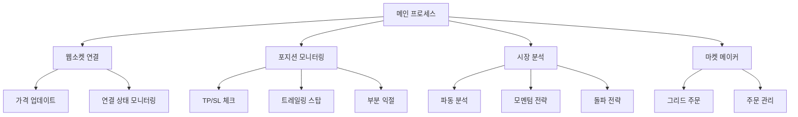
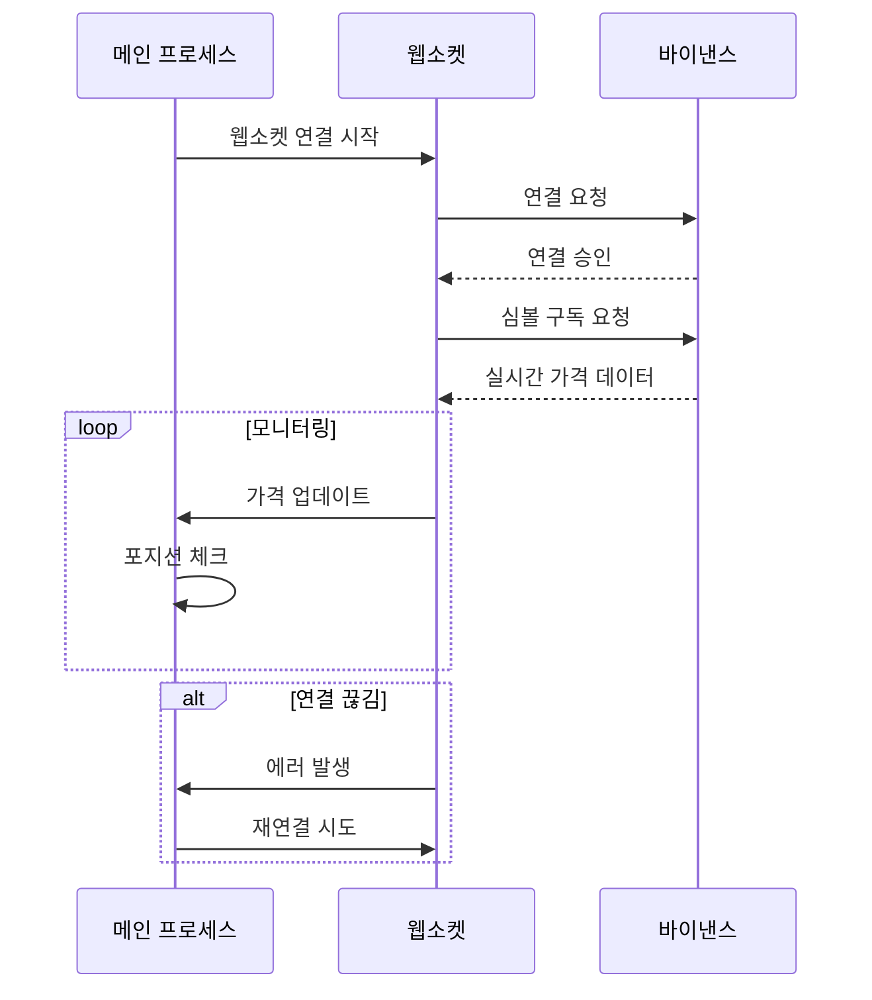
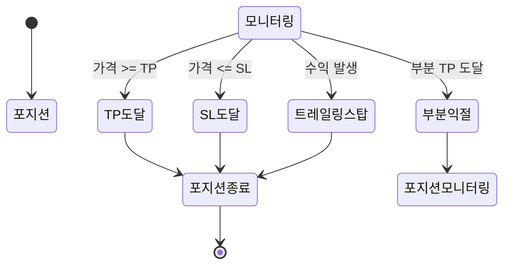
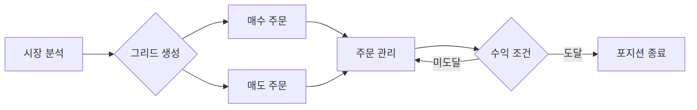
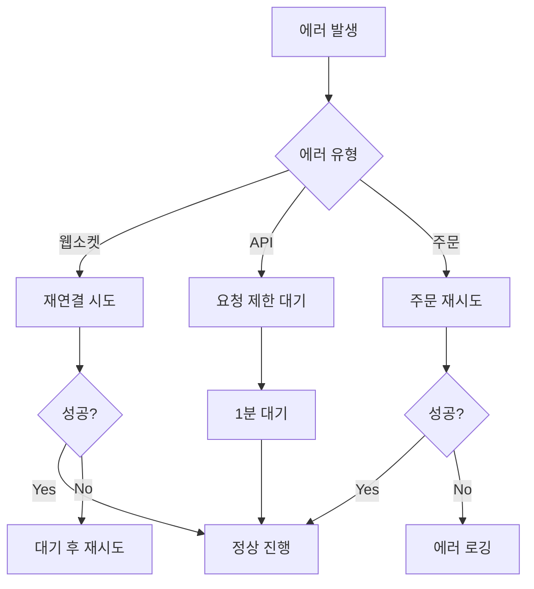

# 트레이딩 봇 시스템 구조 및 로직

## 1. 시스템 아키텍처

## 2. 웹소켓 연결 관리

## 3. 포지션 관리 로직

## 4. 마켓 메이커 전략

## 5. 주요 기능 설명

### 5.1 웹소켓 관리

- 단일 웹소켓 연결로 모든 심볼 구독
- 3개씩 배치 처리로 구독 요청
- 30초 타임아웃으로 연결 상태 모니터링
- 최대 5회 재연결 시도 후 5분 대기

### 5.2 포지션 모니터링

- 0.5초 간격으로 포지션 상태 체크
- TP/SL 조건 실시간 모니터링
- 트레일링 스탑으로 수익 보호
- 부분 익절 전략으로 수익 실현

### 5.3 마켓 메이커 전략

- 최대 3개 레벨의 그리드 주문
- 0.2% 간격으로 주문 배치
- 30분 주문 유효 시간
- 최대 3개 동시 포지션 제한

### 5.4 리스크 관리

- 일일 최대 손실 제한 (5%)
- 최대 동시 포지션 수 제한
- 변동성 기반 포지션 크기 조절
- 상관관계 기반 포지션 분산

## 6. 에러 처리

## 7. 성능 최적화

- 가격 데이터 캐싱으로 API 요청 최소화
- 배치 처리로 웹소켓 구독 부하 감소
- 주기적인 포지션 동기화로 데이터 정확성 유지
- 시스템 리소스 모니터링으로 안정성 확보
